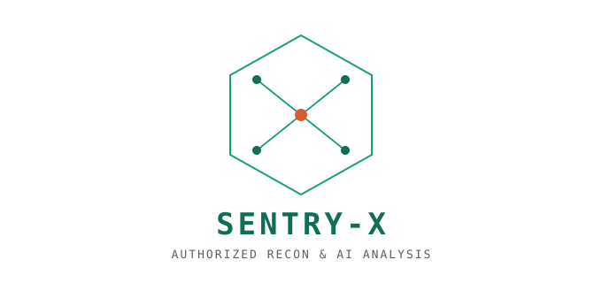

<p align="center">
  
</p>

# SENTRY-X

AI-assisted reconnaissance and vulnerability analysis CLI for **authorized**
penetration testing. Runs standard recon tools (nmap, whois, whatweb, dig,
curl, nikto) against a target, sends the structured output to Claude for
analysis, and stores findings in PostgreSQL with HTML/PDF reporting.

Built as a portfolio project by Youssef Hadeg.


## ⚠️ Authorization requirement

**Only scan systems you own or have explicit written authorization to test.**
Unauthorized scanning is illegal in most jurisdictions. Every scan session
in SENTRY-X has an `authorization_ref` field specifically so you can trace
every scan back to its written authorization - the CLI will warn you if you
try to proceed without one.

## Stack

| Component | Technology | Version |
|---|---|---|
| Language | Python | 3.11+ (developed/tested on 3.12.3) |
| AI | Anthropic API (Claude) | SDK 1.11.0 |
| Database | PostgreSQL | 16 |
| CLI framework | click + rich | 8.5.0 / 15.0.0 |
| Recon tools | nmap, whois, whatweb, dnsutils, curl, nikto | see Dockerfile |
| CVE source | NVD REST API v2.0 | — |
| PDF generation | WeasyPrint | 70.0 |
| Containerization | Docker (Ubuntu 24.04 base) | — |

All dependency versions are pinned in `requirements.txt` /
`requirements-dev.txt`, resolved against the latest stable PyPI release as of
2026-10-04. 

## Project layout

```
sentry-x/
├── src/sentryx/
│   ├── cli.py          # entry point (click commands: scan, list, report, check)
│   ├── tools.py         # recon tool wrappers (subprocess, validated input)
│   ├── validators.py    # target/port validation - command injection defense
│   ├── db.py             # PostgreSQL access layer (parameterized queries)
│   ├── llm.py             # Claude API orchestration, agentic tool-use loop
│   ├── search.py          # NVD CVE lookup
│   ├── report.py          # HTML/PDF report generation
│   └── config.py          # environment-based settings, no hardcoded secrets
├── migrations/
│   └── 001_init.sql       # PostgreSQL schema (idempotent)
├── tests/                 # 95 tests: unit (mocked) + integration (real PostgreSQL)
├── .github/workflows/ci.yml
├── Dockerfile
├── docker-compose.yml
├── requirements.txt / requirements-dev.txt
├── pyproject.toml
├── .env.example
└── RUNBOOK.md              # commands to run, deploy, and roll back
```

## Quick start (local, no Docker)

```bash
# 1. System tools (Ubuntu/Debian)
sudo apt-get install -y nmap whois whatweb dnsutils curl nikto \
    libpango-1.0-0 libpangocairo-1.0-0 libcairo2 libgdk-pixbuf2.0-0 libffi8

# 2. Python environment
python3 -m venv venv
source venv/bin/activate
pip install -r requirements-dev.txt
pip install -e .

# 3. Database
sudo systemctl start postgresql
sudo -u postgres psql -c "CREATE USER sentryx WITH PASSWORD 'change-me';"
sudo -u postgres psql -c "CREATE DATABASE sentryx OWNER sentryx;"
PGPASSWORD=change-me psql -h localhost -U sentryx -d sentryx -f migrations/001_init.sql

# 4. Configure
cp .env.example .env
# edit .env: set SENTRYX_DB_PASSWORD and ANTHROPIC_API_KEY

# 5. Verify tools are on PATH
sentryx check

# 6. Run a scan (against a host you're authorized to test)
sentryx scan --target scanme.nmap.org \
    --authorization-ref "nmap.org public test host" \
    --authorized-by "  "

# 7. List past scans / generate a report
sentryx list
sentryx report --session-id 1 --format html --output report.html
```

## Quick start (Docker)

```bash
cp .env.example .env   # fill in SENTRYX_DB_PASSWORD and ANTHROPIC_API_KEY
docker compose up -d db
docker compose run --rm app sentryx check
docker compose run --rm app sentryx scan --target scanme.nmap.org \
    --authorization-ref "nmap.org public test host"
```

See **RUNBOOK.md** for the full command reference, rollback procedure, and
acceptance checklist.

## License

MIT - see `LICENSE`.
