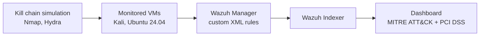

# 🛡️ Youssef Hadeg

### Cybersecurity Graduate · SOC / Blue Team / Security Engineering

📍 Rabat, Morocco &nbsp;|&nbsp; 🟢 **Available immediately for an internship**

---

## 👋 About

Licence in Applied Computer Science & Cybersecurity (Université Mohammed V, Rabat, 2026).
This repository holds **12 documented projects**, mostly lab builds on KVM/QEMU and Docker, focused on **detection, infrastructure hardening and incident response**.

| 🎯 Target roles | 📅 Availability | 🌍 Location |
|---|---|---|
| SOC Analyst Intern · Blue Team · Security Engineer Intern | Immediately | Rabat or remote |

---

## 📊 Skills Snapshot

| Area | Tools and concepts |
|---|---|
| 🔎 **SOC & Detection** | Wazuh (custom XML rules, FIM, rootcheck), MITRE ATT&CK, Cyber Kill Chain, IDS/IPS, honeynet, anomaly detection (Isolation Forest) |
| 🏰 **Infrastructure security** | Zero Trust (Teleport, RBAC, MFA WebAuthn), IPsec VPN, ACL, DHCP Snooping/DAI, Port Security, Root/BPDU Guard, PKI/AD CS |
| 🖥️ **Systems & virtualization** | RHEL 10.1, Windows Server 2022 (AD DS, GPO, DNS/DHCP, WSUS), KVM/QEMU, Docker Compose, GNS3 |
| 🌐 **Networking** | VLAN, STP, OSPF, EIGRP, Wireshark, SNMP, Nagios, Zabbix |
| ⚔️ **Offensive (to support defense)** | Kali Linux, Nmap, Hydra, sqlmap, Nikto, CVE correlation (NVD), OWASP Top 10 |
| 💻 **Programming** | Python, Bash, PowerShell, C/C++, Java, PHP, SQL |

### 🏅 Certifications

-FFA500?style=flat-square&logo=cisco&logoColor=white)

---

## ⭐ Featured Projects

### 1️⃣ Wazuh SOC on virtualized infrastructure
> **37 → 640+ alerts** after 7 custom detection rules, mapped to **6 MITRE ATT&CK tactics** and PCI DSS.

Wazuh (Manager, Indexer, Dashboard) deployed with Docker Compose on KVM/QEMU, monitoring Kali and Ubuntu VMs. Rules were validated with a simulated kill chain (Nmap, Hydra).

📂 [`soc-wazuh-docker`](soc-wazuh-docker) · `Wazuh` `Docker Compose` `KVM/QEMU` `Bash`

### 2️⃣ Zero Trust Network Access (ZTNA)
> **No exposed port:** SSH only through the web terminal, with SSO, 4-role RBAC and WebAuthn MFA.

Three-machine lab with Teleport and GitHub SSO. Wazuh integration with detections mapped to MITRE ATT&CK (T1110, T1078). The initial Keycloak/OIDC design was dropped because Teleport Community does not support it.

📂 [`ztna-lab`](ztna-lab) · `Teleport` `GitHub SSO` `Wazuh` `KVM/QEMU`

### 3️⃣ Honeynet, IDS/IPS engine and mini-SIEM
> **8 attack families detected**, with automatic IP banning and a live Kill Chain view.

Multi-service honeynet (SSH, HTTP, FTP) capturing credentials and payloads (Hydra, sqlmap), plus a mini-SIEM showing Kill Chain progression and a real-time traffic timeline.

📂 [`SOC_SIEM`](SOC_SIEM) · `Python` `Paramiko` `Sockets` `Threading`

### 4️⃣ SENTRY-X: AI-assisted reconnaissance CLI
> **95 tests + GitHub Actions CI**, security-by-design for authorized penetration tests.

Orchestrates Nmap, whois, WhatWeb, dig, curl and Nikto, analyzes the output with the Claude API, enriches findings with CVEs from NVD and produces HTML/PDF reports. Strict target/port validation, parameterized SQL, no hard-coded secrets, written-authorization traceability.

📂 [`OFFENSIVE_SECURITY`](OFFENSIVE_SECURITY) · `Python` `Anthropic API` `PostgreSQL` `Docker`

---

## 📂 All Projects

| Project | Highlights | Stack | Folder |
|---|---|---|---|
| 🔎 Wazuh SOC | 7 custom rules, 37 → 640+ alerts | Wazuh, Docker Compose, KVM/QEMU | [soc-wazuh-docker](soc-wazuh-docker) |
| 🏰 Zero Trust (ZTNA) | SSO, RBAC, WebAuthn MFA, no exposed port | Teleport, GitHub SSO, Wazuh | [ztna-lab](ztna-lab) |
| 🍯 Honeynet + IDS/IPS + mini-SIEM | 8 attack families, automatic banning | Python, Paramiko, Sockets | [SOC_SIEM](SOC_SIEM) |
| 🤖 Network anomaly detection | Isolation Forest (150 estimators) on NSL-KDD | Python, Scikit-Learn, Pandas | [MACHINE LEARNING](MACHINE%20LEARNING) |
| 🎫 GLPI ITSM | Incident workflow with a 4h cybersecurity SLA | GLPI, Docker Compose | [glpi-itsm-security](glpi-itsm-security) |
| 🔐 Site-to-site IPsec VPN | IKEv1, AES-256, DH14, ESP-only traffic seen in Wireshark | Cisco IOS, GNS3 | [NETWORKING & INFRA_DEFENSE](NETWORKING%20%26%20INFRA_DEFENSE) |
| 🧱 Layer 2 hardening | DHCP Snooping, DAI, Port Security, Root/BPDU Guard | Cisco IOS | [NETWORKING & INFRA_DEFENSE](NETWORKING%20%26%20INFRA_DEFENSE) |
| 🪟 Microsoft IT infrastructure lab | Multi-DC AD, GPO, WSUS, AD CS, linked clones (disk ÷5) | Windows Server 2022, KVM/QEMU | [microsoft-it-infra-lab](microsoft-it-infra-lab) |
| 🛰️ SENTRY-X | AI-assisted recon and CVE enrichment, 95 tests | Python, PostgreSQL, Docker | [OFFENSIVE_SECURITY](OFFENSIVE_SECURITY) |
| 🌐 Secure web application | PDO prepared statements, SQLi/XSS protection | PHP, MySQL | [SECURE_WEB_DEV](SECURE_WEB_DEV) |
| 🔑 Applied cryptography | 8 systems from scratch (AES, RSA, ECC, ElGamal...) | Python | [CRYPTO](CRYPTO) |
| 📐 Machine learning fundamentals | Regression and softmax from scratch | Python, NumPy | [MACHINE LEARNING](MACHINE%20LEARNING) |

---

## 📈 GitHub Activity

---

## 📬 Contact

I am looking for an internship in **SOC, Blue Team or Security Engineering**, in Rabat or remote.

- 📧 Email: [youssefelhadeg2002@gmail.com](mailto:youssefelhadeg2002@gmail.com)
- 💼 LinkedIn: [youssef-hadeg-248a76247](https://www.linkedin.com/in/youssef-hadeg-248a76247/)

*Hands-on projects in defensive infrastructure, detection engineering and secure design.*

