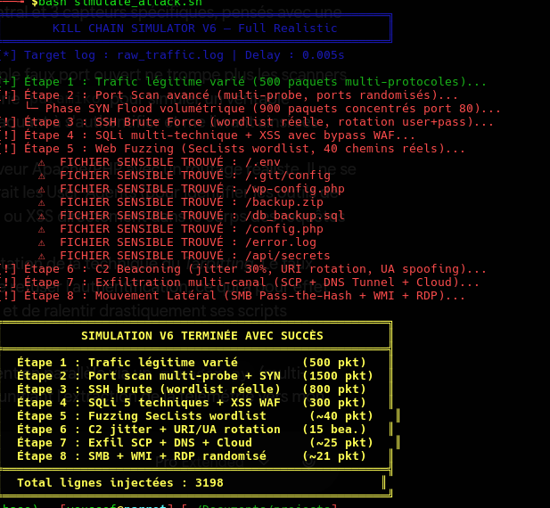

# 🛡️ Mini SIEM & IDS/IPS Engine

A self-contained, educational SOC (Security Operations Center) simulator built in Python.
It generates realistic network traffic — including a full multi-stage attack — detects it in
real time with signature- and threshold-based rules, and visualizes everything on a live
terminal dashboard.

Built to learn, hands-on, how intrusion detection, log aggregation, and behavioral
correlation actually work under the hood.

---

## ✨ Features

- **Traffic generator** simulating 3000+ packets: legitimate background traffic mixed with
  a complete attack chain.
- **IDS/IPS engine** combining:
  - Instant signatures (SQLi, XSS, sensitive file access, data exfiltration)
  - Frequency-based detection with **sliding time windows** (SSH brute force, port
    scanning, web directory fuzzing, C2 beaconing) — so a single suspicious line doesn't
    trigger a ban, but a *pattern* does
  - **Distinct-target tracking** for lateral movement (an internal host probing many other
    hosts in a short window)
  - Active mitigation: automatic IP banning with **expiration** and **disk persistence**
    (`banned_ips.json`), survives restarts
- **Two dashboards**:
  - `mini_siem.py`  — rich, full-screen SOC dashboard (built with [Rich](https://github.com/Textualize/rich)): severity breakdown, top threats, top attackers, a live sparkline timeline, a scrolling alert feed, and a **Cyber Kill Chain progress tracker**
- Noise isolation: packets dropped because the source IP is already banned are counted
  separately, so they don't drown out genuinely new threats in the stats.

## 🎯 Attack scenarios covered (Cyber Kill Chain)

| Stage | Simulated technique |
|---|---|
| Reconnaissance | Port scanning / SYN flood, web directory fuzzing (Gobuster-style) |
| Intrusion | SQL injection, XSS, SSH brute force, sensitive file access |
| Command & Control | Malware beaconing to an external C2 server |
| Lateral Movement | Internal SMB / pass-the-hash style probing across multiple hosts |
| Exfiltration | Large outbound data transfer |

## 📂 Project structure

```
.
├── simulate_attack.sh        # Traffic generator (legitimate + full attack chain)
├── ids_ips_engine.py         # Detection engine (signatures, sliding windows, IP banning)
├── mini_siem.py                # Advanced dashboard (requires Rich)
├── raw_traffic.log           # Generated network traffic (created at runtime)
├── ids_alerts.log            # Alerts emitted by the IDS/IPS engine (created at runtime)
└── banned_ips.json           # Persisted ban list (created at runtime)
```

> English-language versions of the engine, simulator, and advanced dashboard are also
> available as `*_en.py` / `*_en.sh` files if you'd rather read the code itself in English.

## 🚀 Getting started

### Requirements

- Python 3.8+
- Bash
- For the advanced dashboard only: [`rich`](https://pypi.org/project/rich/)

```bash
pip install rich --break-system-packages   # only needed for mini_siem_advanced.py
```

### Run it

Open three terminals:

```bash
# Terminal 1 — detection engine
python3 ids_ips_engine.py

# Terminal 2 — dashboard 
python3 mini_siem.py


# Terminal 3 — traffic simulator
chmod +x simulate_attack.sh
./simulate_attack.sh            # default delay
./simulate_attack.sh 0.01       # slower, to watch the dashboard evolve live
```

The engine tails `raw_traffic.log` in real time, flags malicious patterns, bans offending
IPs, and writes alerts to `ids_alerts.log`. The dashboard tails that alert log and renders
live statistics.

## 🧠 How detection works

- **Instant signatures** match a single line (e.g. a SQL injection payload) and trigger
  immediately.
- **Frequency signatures** use a sliding time window per attack type and per source IP —
  an attack is only flagged once a *threshold* of matching events occurs within that window
  (e.g. 5+ failed SSH logins in 10 seconds), which avoids false positives on a single noisy
  packet while still catching automated tools quickly.
- **Lateral movement** is detected by counting *distinct internal targets* contacted by the
  same source within a window, rather than raw event count — closer to how real SMB/pass-
  the-hash probing behaves.
- Banned IPs are **persisted to disk** and **expire automatically** after a configurable
  duration, so the IPS state survives a restart without permanently blacklisting an IP
  forever.

## ⚠️ Disclaimer

This project is for **educational purposes only**. It runs entirely on local, synthetic log
files — no real network traffic is captured, intercepted, or attacked. Do not point any
part of this project at systems or networks you don't own or have explicit permission to
test.

## 📜 License

MIT — feel free to fork, extend, and use this as a learning base.
