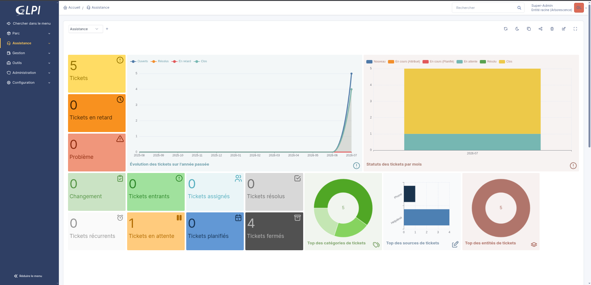
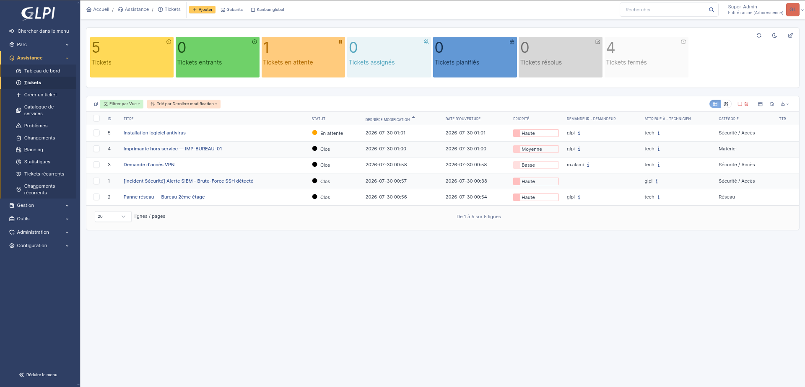
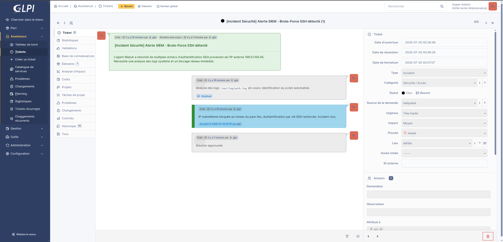
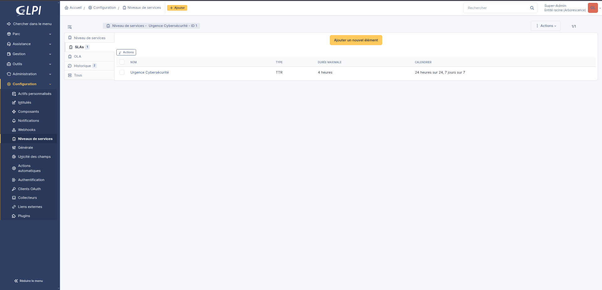

# GLPI — Gestion des tickets IT & Sécurité

Déploiement et configuration d'une plateforme ITSM (GLPI) orientée gestion des incidents de sécurité, avec inventaire du parc informatique, workflow de tickets et SLA dédié à la cybersécurité.

## Contexte
En analysant des offres d'emploi cybersécurité/IT au Maroc et en France, j'ai remarqué qu'un nombre significatif de postes (SOC, support sécurité, administration systèmes) mentionnent la maîtrise d'un outil de ticketing/ITSM (GLPI, ServiceNow, Jira Service Desk...) comme compétence attendue, en complément des outils purement techniques (SIEM, EDR, etc.). J'ai donc déployé GLPI pour combler ce gap et illustrer comment un outil de gestion IT s'articule avec un workflow de détection/réponse à incident.

## Objectifs du projet
*   Déployer GLPI et le configurer pour un cas d'usage cybersécurité.
*   Construire un inventaire du parc (ordinateurs, matériel réseau, imprimantes...).
*   Modéliser un workflow de ticket réaliste pour un incident de sécurité, du signalement à la clôture.
*   Définir un SLA (niveau de service) spécifique aux incidents cybersécurité.
*   Illustrer la complémentarité entre un outil de détection (SIEM/Wazuh) et un outil de gestion des tickets (GLPI).

## Stack technique
*   **GLPI** (dernière version stable)
*   **Docker / Docker Compose** pour le déploiement
*   Intégration conceptuelle avec **Wazuh (SIEM)** pour le scénario d'incident

## Fonctionnalités mises en place

### 1. Tableaux de bord
*   **Dashboard Assistance :** Suivi des tickets (ouverts, en retard, résolus, clos), évolution sur l'année, répartition par statut/catégorie/source.
*   **Dashboard Parc :** Inventaire des actifs (ordinateurs, matériel réseau, imprimantes...) avec répartition par fabricant et par type.

### 2. Gestion des tickets
Plusieurs catégories de tickets modélisées pour couvrir des cas réels :
*   Incident de sécurité (alerte SIEM, brute-force SSH)
*   Demande d'accès (VPN)
*   Panne réseau
*   Panne matérielle (imprimante)
*   Installation logicielle

### 3. Scénario détaillé — Incident de sécurité
Ticket illustrant un workflow de réponse à incident de bout en bout :
*   **Détection :** Alerte générée suite à des échecs d'authentification SSH répétés depuis une IP externe (simulant une remontée Wazuh).
*   **Analyse :** Investigation des logs d'authentification, identification du script à l'origine de l'attaque.
*   **Remédiation :** Blocage de l'IP malveillante au niveau du pare-feu, renforcement de l'authentification par clé SSH.
*   **Clôture :** Validation de la solution et fermeture du ticket.
*   *Champs renseignés :* Catégorie (Sécurité/Accès), urgence, impact, priorité, lieu, source de la demande.

### 4. SLA cybersécurité
Un niveau de service dédié (« Urgence Cybersécurité ») a été configuré :
*   **Type :** TTR (Temps de résolution)
*   **Durée maximale :** 4 heures
*   **Calendrier :** 24h/24, 7j/7

## Ce que ce projet démontre
*   Capacité à déployer et administrer un outil ITSM en environnement conteneurisé.
*   Compréhension du cycle de vie d'un ticket d'incident de sécurité (détection → analyse → remédiation → clôture).
*   Notion de SLA/temps de réponse appliquée à un contexte cybersécurité.
*   Vision transverse : articulation entre outils de détection (SIEM) et outils de gestion IT (ITSM), une compétence recherchée dans les rôles Blue Team/SOC juniors.

## Pistes d'amélioration
*   Automatiser la création de tickets via l'API GLPI déclenchée par une alerte Wazuh (webhook).
*   Ajouter des règles métier pour l'assignation automatique des tickets selon la catégorie.
*   Étendre l'inventaire avec la CMDB liée aux équipements de mon lab Wazuh/ZTNA.

## Captures d'écran

### Tableau de bord de l'Assistance

### Tableau de bord de l'Inventaire du Parc Informatique

### File d'Attente et Suivi des Tickets

### Détail d'un Ticket d'Incident de Sécurité

### Configuration des Niveaux de Service (SLA)

---
**Auteur :** Youssef — [github.com/youssef2571-cyber/cybersec-portfolio](https://github.com/youssef2571-cyber/cybersec-portfolio)
