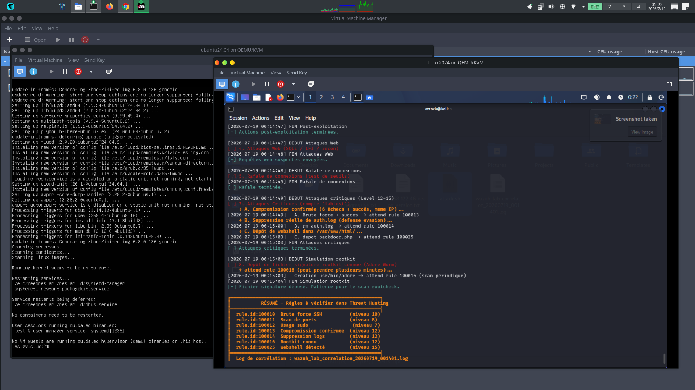
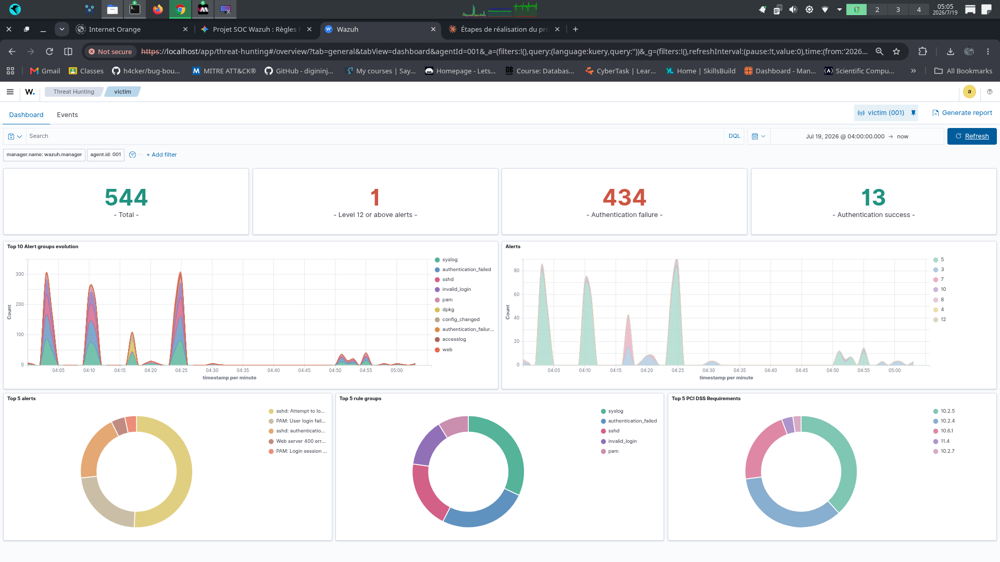
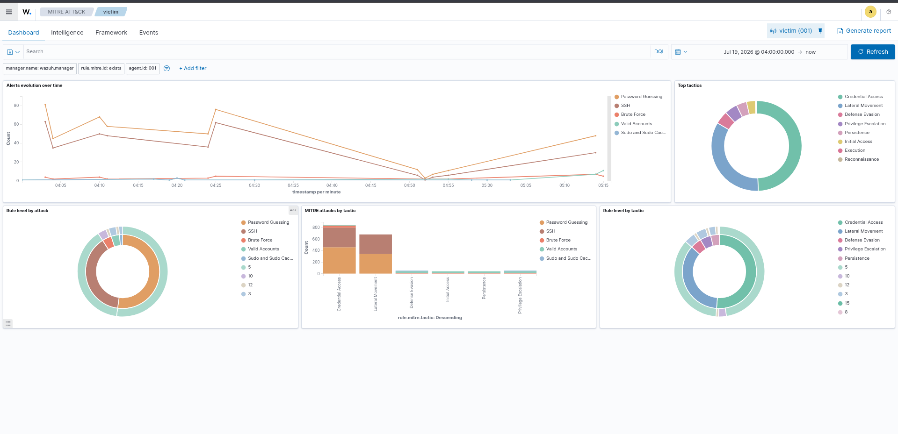
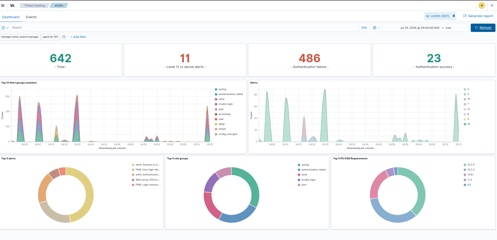
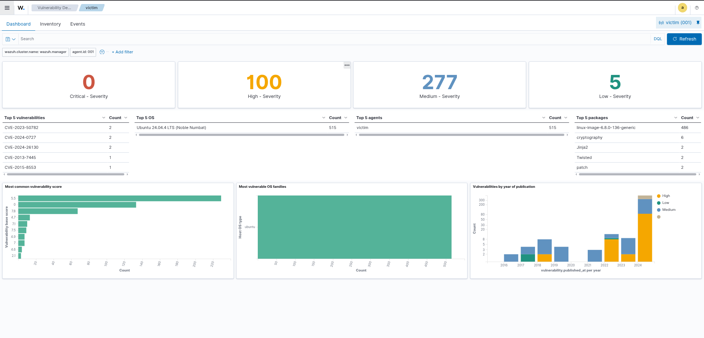

# SOC Wazuh — Détection d'intrusion, Threat Hunting & MITRE ATT&CK

Déploiement d'un mini-SOC (Security Operations Center) basé sur **Wazuh**, avec ingestion de logs, création de règles de détection personnalisées et simulation d'attaques réelles (kill chain) pour valider le pipeline de bout en bout.

Ce projet fait suite à un Honeynet et un Mini-SIEM développés précédemment en Python : il apporte une expérience concrète sur un **SIEM professionnel** largement utilisé en entreprise, avec une approche orientée *Detection Engineering* plutôt qu'une simple installation par défaut.

---

## Sommaire

- [Architecture](#architecture)
- [Stack technique](#stack-technique)
- [Règles de détection personnalisées](#règles-de-détection-personnalisées)
- [Simulation d'attaques](#simulation-dattaques)
- [Résultats](#résultats)
- [Détection de vulnérabilités](#détection-de-vulnérabilités-bonus)
- [Compétences démontrées](#compétences-démontrées)
- [Pistes d'évolution](#pistes-dévolution)
- [Rapport détaillé](#Rapport-détaillé)
---

## Architecture


Le lab repose sur trois couches :

- **Virtualisation (QEMU/KVM)** : une VM Kali Linux (attaquant) et une VM Ubuntu Server 24.04 (victime, avec l'agent Wazuh installé) sur un réseau bridge dédié.
- **Infrastructure conteneurisée (Docker Compose)** : Wazuh Manager, Wazuh Indexer (OpenSearch) et Wazuh Dashboard, déployés sur l'hôte physique (Parrot OS).
- **Flux de données** : la victime remonte ses logs (FIM, syslog, logs web) vers le Manager, qui applique les règles de détection (natives + custom) avant indexation et visualisation.

---

## Stack technique

| Composant | Rôle |
|---|---|
| Docker / Docker Compose | Orchestration de la stack Wazuh |
| Wazuh Manager | Moteur de règles, corrélation, décodage des logs |
| Wazuh Indexer (OpenSearch) | Stockage et indexation des alertes |
| Wazuh Dashboard | Visualisation, Threat Hunting, mapping MITRE ATT&CK |
| QEMU/KVM | Virtualisation des machines attaquante et victime |
| Ubuntu Server 24.04 | Endpoint victime avec agent Wazuh |
| Kali Linux | Machine attaquante |
| Bash | Script d'automatisation des scénarios d'attaque |

---

## Règles de détection personnalisées

Au-delà des règles natives de Wazuh, plusieurs règles ont été écrites sur mesure dans `rules/local_rules.xml`, avec vérification manuelle de chaque `if_sid`/`if_matched_sid` référencé contre le ruleset réel (pas de règle "copiée-collée" sans validation).

| Rule ID | Niveau | Description | MITRE ATT&CK |
|---|:---:|---|---|
| `100010` | 10 | Brute force SSH (6 échecs / 60s, même IP source) | T1110 |
| `100011` | 8 | Scan de ports (comportement type Nmap) | T1046 |
| `100012` | 7 | Utilisation de `sudo` — surveillance élévation de privilèges | T1548 |
| **`100013`** | **12** | **Compromission confirmée** : authentification SSH réussie juste après une série d'échecs (brute force abouti) | T1110, T1078 |
| **`100014`** | **12** | **Suppression d'un fichier de log système** (`auth.log`/`syslog`) — effacement de traces | T1070, T1070.002 |
| **`100016`** | **12** | **Rootkit connu détecté** par rootcheck (signature réelle, ex. Adore Worm) | T1014 |
| **`100025`** | **15** | **Webshell déposé** dans le webroot (`/var/www/html`, extensions `.php/.sh/.py`) | T1505.003 |

La règle `100013` illustre une approche de *compound rule* : plutôt que de dépendre d'un ID de règle native au comportement incertain selon les versions, elle escalade directement depuis `100010`, garantissant un comportement prévisible et documenté.

---

## Simulation d'attaques

Un script (`scripts/wazuh_attack_lab.sh`) automatise une kill chain complète depuis Kali contre la victime, en exécutant de **vraies actions réseau/système** (pas des logs simulés) afin que chaque étape génère des événements natifs captés par l'agent Wazuh :

1. **Reconnaissance** — scans Nmap (version, agressif, UDP)
2. **Brute force SSH** — rotation utilisateur/mot de passe
3. **Post-exploitation** — création/suppression d'utilisateur, lecture de fichiers sensibles
4. **Attaques web** — SQLi basique, path traversal, LFI
5. **Rafale de connexions** — test de seuils de détection
6. **Trafic légitime** — contrôle de l'absence de faux positifs
7. **Attaques critiques** — compromission confirmée, suppression de logs, dépôt de webshell (niveau 12-15)
8. **Rootkit** — dépôt d'une signature reconnue par rootcheck

Chaque exécution génère un log de corrélation horodaté, permettant de faire correspondre précisément une action à l'alerte Wazuh générée.

```bash
./wazuh_attack_lab.sh <IP_VICTIME> all --cleanup
```

**Exécution du scénario critique (niveau 12-15)** — chaque étape est horodatée et annotée avec la règle Wazuh attendue, facilitant la corrélation avec le dashboard :



---

## Résultats

**Vue d'ensemble du dashboard** — alertes classées par sévérité, groupes de règles et conformité PCI DSS :



**Mapping MITRE ATT&CK** — tactiques couvertes automatiquement par les règles déclenchées (Credential Access, Lateral Movement, Defense Evasion, Privilege Escalation) :



**Alertes critiques (niveau 12+)** — passage de 0 à plusieurs dizaines d'alertes critiques après exécution de la kill chain complète, correspondant aux règles `100013`, `100014`, `100016` et `100025` :



---

## Détection de vulnérabilités (bonus)

Le module natif **Vulnerability Detection** de Wazuh a également été activé et testé sur l'agent Ubuntu, sans configuration additionnelle particulière — il scanne automatiquement les paquets installés et les confronte à des bases de CVE publiques :



Résultat sur la VM victime : 515 paquets analysés, avec détection de CVE réparties par sévérité (dont plusieurs en sévérité *High*), démontrant la capacité de Wazuh à aller au-delà de la simple détection d'intrusion pour couvrir la gestion de vulnérabilités.

---

## Compétences démontrées

- Déploiement et administration d'un SIEM professionnel (Wazuh) via Docker Compose
- Écriture de règles de détection XML avec logique de corrélation (`if_matched_sid`, `same_source_ip`, `frequency`/`timeframe`)
- Configuration de File Integrity Monitoring (FIM) et de Rootcheck sur un agent Linux
- Méthodologie de vérification (aucune règle chargée sans validation de l'ID réel dans le ruleset)
- Mapping des détections au framework MITRE ATT&CK
- Scripting Bash pour l'automatisation de scénarios de test reproductibles
- Compréhension d'une kill chain complète : reconnaissance → accès initial → post-exploitation → defense evasion → persistence

---

## Pistes d'évolution

- Intégration de **Suricata** pour la détection réseau (IDS) en complément de la détection basée logs
- Migration d'une partie du lab vers **Elastic Stack** ou **Microsoft Sentinel** pour comparer les approches SIEM
- Ajout d'un second agent Windows pour tester les règles Sysmon natives de Wazuh
- Automatisation du déploiement complet via un playbook Ansible

---

## Structure du repo

```
soc-wazuh-docker/
├── README.md
├── docker-compose.yml          
├── rules/
│   └── local_rules.xml
├── scripts/
│   └── wazuh_attack_lab.sh
├── docs/
│   ├── architecture.png        
│   └── screenshots/
│       ├── 01-agent-active.png
│       ├── 02-dashboard-overview.png
│       ├── 03-mitre-attack-map.png
│       ├── 04-level12-alerts.png
│       └── 05-webshell-detection.png
└── report.md
```
---
## Rapport détaillé


📄 Pour une documentation détaillée de la méthodologie (difficultés rencontrées, résolutions, processus de vérification), voir [report.md](report.md).
